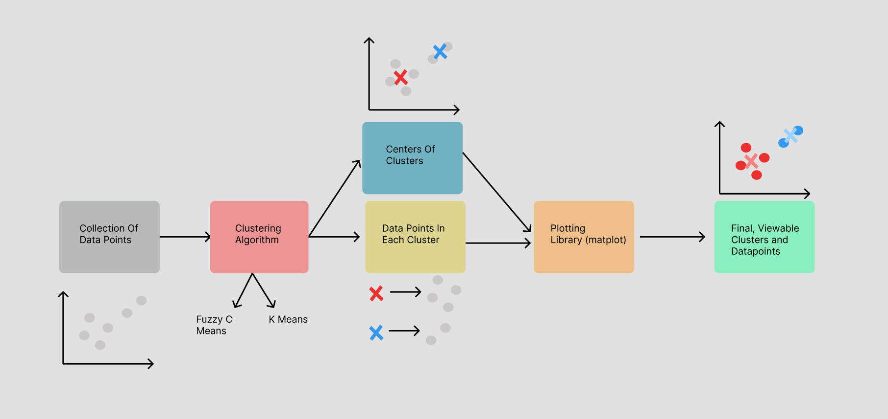

# Fuzzy C Means And K Means Algorithm
## An implementation of the Fuzzy C Means and K Means clustering algorithms, as well as the corresponding algorithms from `scikit_learn` and `skfuzzy`, used for developing centers for collections of data points. 

## The examples use blobs of data points, individual image pixels, and groups of images, as a means to demonstrate, teach, and evaluate these algorithms.

### Requirements

#### Language: `Python 3.9.1`

#### Packages: 
- `matplotlib, numpy, pandas, scikit_learn, scipy, opencv_python`
- ##### NOTE: these packages and the corresponding versions are included in `requirements.txt` and can be installed all at once (refer to [Installation](#installation) Step 2).

### Hardware / OS

#### OS: `macOS Monterey 12.3.1`

#### Processor: `2.3 GHz 8-Core Intel Core i9`

### Installation

1. Clone the repo
```sh
git clone https://github.com/linschris/clustering-algorithms.git
```
2. Install the dependencies
```sh
pip install -r requirements.txt (Python2)
pip3 install -r requirements.txt (Python3)
```
### You should be good to go!

#### However, if you want to test an example beforehand:

Navigate to the `examples` folder within the `code` folder, and run `clustering_blobs.py` to confirm 
this file runs without errors and renders blobs of data points before and after they are clustered.

### Before we step into the code and examples...

From a high level, the clustering algorithm(s) simply takes:
- collections of data points of any dimension (here, just 2 for x, y)
    - This will be represented as numpy array (`ndarray`), which is a 

and groups them together by:
- placing "centers" or centroids which acts as the centers of groups of data points nearby to one another.
- adjusting the positions of the centroids, such that they minimize the total sum of distance(s) of data points to 
the nearest given cluster for that data point.
 
In other words, the algorithms places and adjusts the positions of these centroids, or points which act as "hot spots" where many data points are located. Based on a distance metric, the algorithm determines which data points belong to what cluster. Using the average positions of the data points in a given cluster, the centroid adjusts to have the average position values (mean x, mean y) of all the data points in its given cluster.

The centroids will often adjust their positions until their positions stop changing, at which case the algorithm is complete.



### The Clustering Algorithms

With this high level, I encourage you to look into `code/implementations` which contains the implementations for both *Fuzzy C Means* and *K Means*; look first at `KMeans.py` and after `FuzzyCMeans.py`.

#### Following the comments, we can deduce a similar pattern as described above:
- We initialize the clusters to be at random positions or to be at the same position as random datapoints
- For every data point, we calculate the nearest cluster and store it.
- For every cluster, calculate the mean position of all the data points within that cluster, this will be the new position of the centroid of the cluster.
- Repeat the last two steps above while the centroid positions are still changing.

A brief thing to note is that for FCM (Fuzzy C Means), to allow for "soft" clustering (i.e. a datapoint can reside in many clusters), we utilize membership or "belongingness" values based on a distance metric as well. In a very similar fashion to K-Means (but different mathematically), we readjust the centroid positions and belongingness values to form the clusters, with the idea of minimizing the sum of distance(s) of data points (w.r.t membership values) to the nearest given cluster for that data point!


### Gratitude

A special thanks to these tutorials, explanations, and guides for teaching me the
knowledge to understand, implement, and manipulate these algorithms:
* [Aktas](https://towardsdatascience.com/image-segmentation-with-clustering-b4bbc98f2ee6)
    * View her original code [here](https://github.com/YCAyca/Image-Segmentation/tree/main/Clustering).
* [Khushijain](https://medium.com/nerd-for-tech/k-means-python-implementation-from-scratch-8400f30b8e5c)
* [The Academician](https://www.youtube.com/watch?v=FA-hJBu5Bkc&t=1469s)
* [GeeksforGeeks](https://www.geeksforgeeks.org/ml-fuzzy-clustering/)

[//]: # (TODO: Add other tutorials I find and a tutorial for evaluation.)