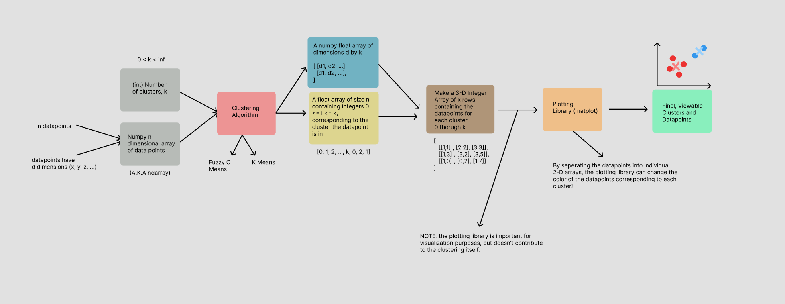
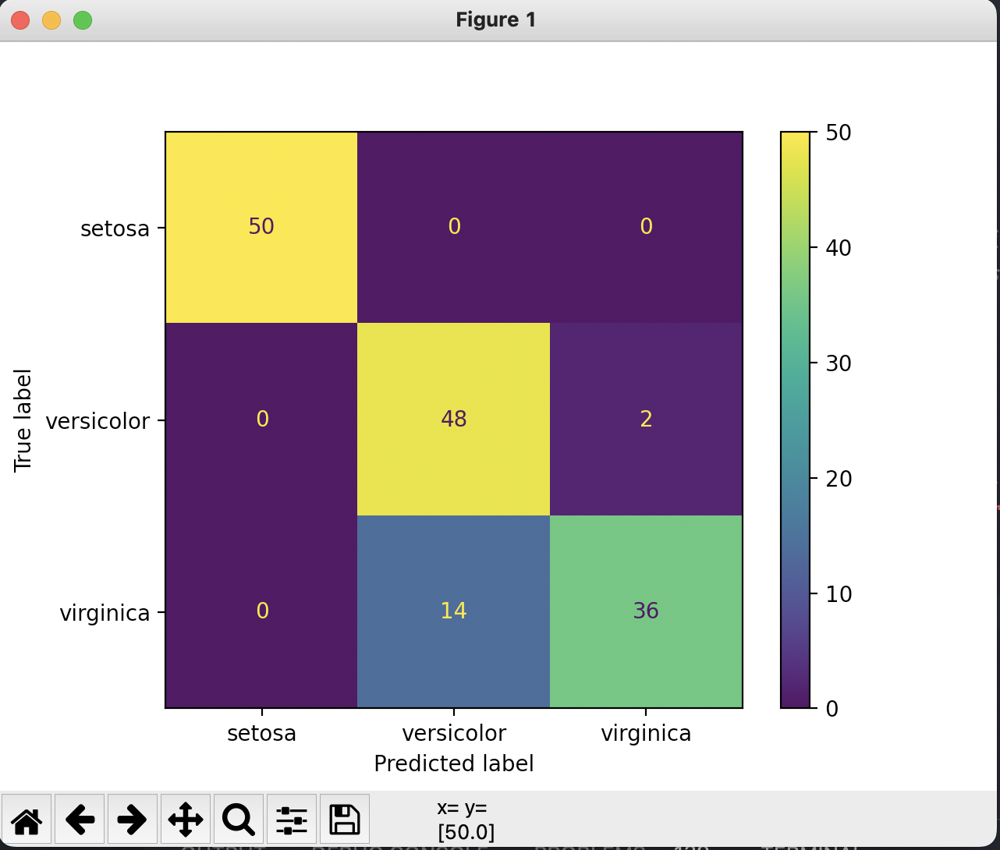
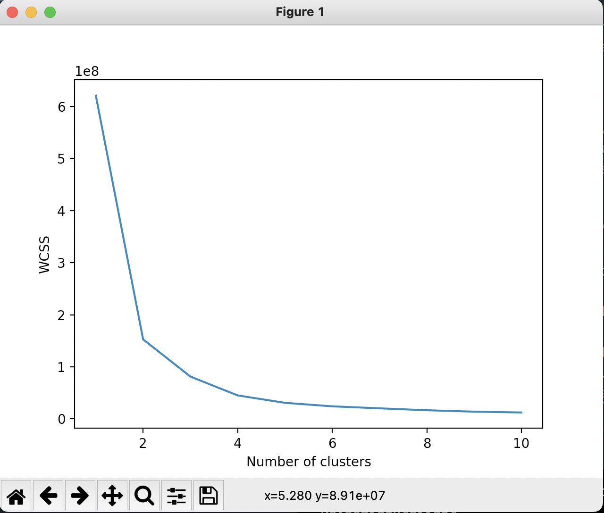
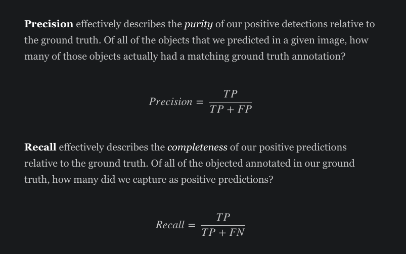

# Fuzzy C Means And K Means Algorithm
## An implementation of the Fuzzy C Means and K Means clustering algorithms, as well as the corresponding K Means from `scikit_learn`, used for developing centers for collections of data points. 

## NOTE: Due to complications with using the module skfuzzy, I only included examples utilizing and evaluating `KMeans`; Fuzzy C Means's implementation can be still explored, and KMeans is a very close relative regardless.

## The examples use blobs of data points, individual image pixels, and groups of images, as a means to demonstrate, teach, and evaluate these algorithms.

### Requirements

#### Language: `Python 3.9.1`

#### Packages: 
- `matplotlib, numpy, pandas, scikit_learn, scipy, opencv_python`
- ##### NOTE: these packages and the corresponding versions are included in `requirements.txt` and can be installed all at once (refer to [Installation](#installation) Step 2).

### Hardware / OS

#### OS: `macOS Monterey 12.3.1`

#### Processor: `2.3 GHz 8-Core Intel Core i9`

### Installation

1. Clone the repo
```sh
git clone https://github.com/linschris/clustering-algorithms.git
```
2. Install the dependencies
```sh
pip install -r requirements.txt (Python2)
pip3 install -r requirements.txt (Python3)
```
### You should be good to go!

#### However, if you want to test an example beforehand:

Navigate to the `examples` folder within the `code` folder, and run `clustering_blobs.py` to confirm 
this file runs without errors and renders blobs of data points before and after they are clustered.

### Before we step into the code and examples...

From a high level, the clustering algorithm(s) simply takes:
- collections of data points of any dimension (here, just 2 for x, y)
    - This will be represented as numpy array (`ndarray`), which is a 

and groups them together by:
- placing "centers" or centroids which acts as the centers of groups of data points nearby to one another.
- adjusting the positions of the centroids, such that they minimize the total sum of distance(s) of data points to 
the nearest given cluster for that data point.
 
In other words, the algorithms places and adjusts the positions of these centroids, or points which act as "hot spots" where many data points are located. Based on a distance metric, the algorithm determines which data points belong to what cluster. Using the average positions of the data points in a given cluster, the centroid adjusts to have the average position values (mean x, mean y) of all the data points in its given cluster.

The centroids will often adjust their positions until their positions stop changing, at which case the algorithm is complete.


### The Clustering Algorithms

With this high level, I encourage you to look into `code/examples/implementations` which contains the implementations for both *Fuzzy C Means* and *K Means*; look first at `KMeans.py` and after `FuzzyCMeans.py`.

#### Following the comments, we can deduce a similar pattern as described above:
- We initialize the clusters to be at random positions or to be at the same position as random datapoints
- For every data point, we calculate the nearest cluster and store it.
- For every cluster, calculate the mean position of all the data points within that cluster, this will be the new position of the centroid of the cluster.
- Repeat the last two steps above while the centroid positions are still changing.

A brief thing to note is that for FCM (Fuzzy C Means), to allow for "soft" clustering (i.e. a datapoint can reside in many clusters), we utilize membership or "belongingness" values based on a distance metric as well. In a very similar fashion to K-Means (but different mathematically), we readjust the centroid positions and belongingness values to form the clusters, with the idea of minimizing the sum of distance(s) of data points (w.r.t membership values) to the nearest given cluster for that data point!

### What do we need data-wise?

From a high level, this is the data we'll need (colors refer to same colors of modules in previous image):



The main form of data is Numpy nd arrays, which act great for storing large amounts of integers, in this case often n * k * d integers, where n is the number of data points, k is the number of clusters, and d is the number of dimensions. NumPy has useful features within its library for creating and modifying this arrays quickly, however often the ndarray arrays are of type `float` and to convert them to int arrays, we use `arr.astype(int)` for utilizes indexing for the plotting library.

### With this flow of data and algorithms, we can cluster many different forms of data, utilizing either our own implementations (with some limitations) or the sklearn K-Means algorithms and datasets (iris, digits) to show the strength of these algorithms. 

### Evaluation

#### With evaluation, we can use many metrics given by the sklearn library such as:

__Davie Boulden's Score__
- Can assess the strength of a clustering algorithm without knowing the ground truth. As noted by [sklearn](https://scikit-learn.org/stable/modules/generated/sklearn.metrics.davies_bouldin_score.html), the score is defined as the:
> "average similarity measure of each cluster with its most similar cluster, where similarity is the ratio of within-cluster distances to between-cluster distances"

> "clusters which are farther apart and less dispersed will result in a better score."

- The minimum score is zero, and lower values indicate better clustering.

__Confusion Matrix__
- Given the ground truth and the predictions, it will plot them in a matrix, with the correct predictions along the diagonal and the incorrect predictions on other side of the main diagonal (top left corner to bottom right corner).
- These matrices can be created very easily with the `ConfusionMatrixDisplay` method, and with the ground truth data of digits and irises, we can test them all at once. A main issue is that if the classes don't match up (i.e. the clusters are correct, but the classes for the clusters are incorrect), the Confusion Matrix will be misleading.



__Elbow Method__
- Given the data points and the clustering algorithm, how many clusters is enough? The idea is at some point, the increasing number of clusters has diminishing returns (i.e. data points can find a close cluster already with fewer clusters available).
- The Elbow Method evaluates the __best number of clusters__ for clustering the given data; this is very useful for clustering algorithms such as FCM or K-Means.

The main idea behind the Elbow Method is plotting the __WCSS (Within Cluster Sum Square)__, which is the *sum of the squared distance* between each point and the centroid in the cluster.

As you plot more clusters, WCSS will decrease at a slower rate, and have diminishing returns.

For the sklearn library, the K-Means method has a `_inertia` property which is the same as WCSS.

As an example, here's what the elbow method determines for the number of clusters for this image:




#### We can deduce this to mean roughly 3 clusters is best, as it forms the "elbow" (also called the knee sometimes) of this graph.

__Classification Report__
- Given the ground truth and predictions, the classification report can give information about the __accuracy, precision, f1-score, and support__
of the clustering algorithm by computing various formulas given the True Positive, True Negative, False Positive, and False Negative the same as shown
in other tutorials such as [Jeremy's blog](https://www.jeremyjordan.me/evaluating-image-segmentation-models/).




### These metrics are all tested with example data from the iris and digits dataset from `sklearn` in `code/examples/evaluating_clusters.py`

### Gratitude

A special thanks to these tutorials, explanations, and guides for teaching me the
knowledge to understand, implement, and manipulate these algorithms:
* [Aktas](https://towardsdatascience.com/image-segmentation-with-clustering-b4bbc98f2ee6)
    * View her original code [here](https://github.com/YCAyca/Image-Segmentation/tree/main/Clustering).
* [Khushijain](https://medium.com/nerd-for-tech/k-means-python-implementation-from-scratch-8400f30b8e5c)
* [The Academician](https://www.youtube.com/watch?v=FA-hJBu5Bkc&t=1469s)
* [GeeksforGeeks](https://www.geeksforgeeks.org/ml-fuzzy-clustering/)
* [Jeremy Jordan](https://www.jeremyjordan.me/evaluating-image-segmentation-models/)
* [SciKit Tutorial](https://scikit-learn.org/stable/modules/clustering.html#clustering)

[//]: # (TODO: Add other tutorials I find and a tutorial for evaluation.)